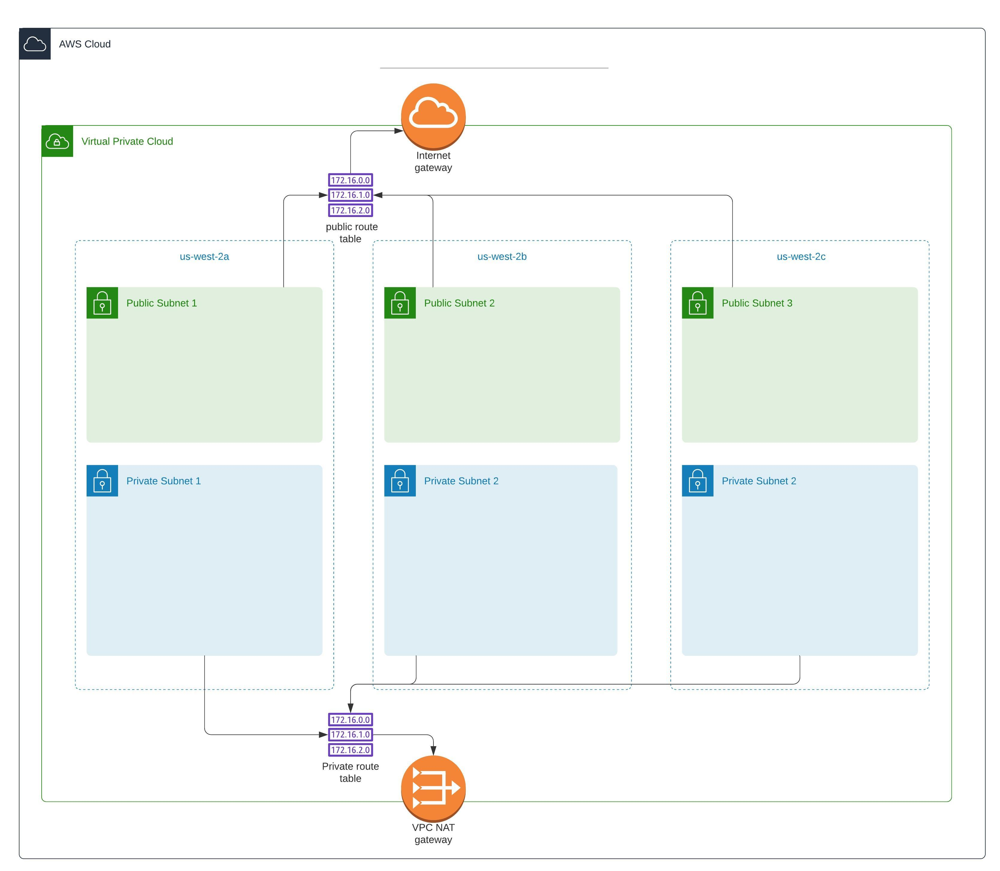

# Triaxiom Infra

## Description

The following terraform templates launch infrastructure for Triaxiom

### Diagram

 * The following diagram shows the resources created by the template

 


## Launch Infrastructure

### Variables

| Name        | Description   | Type | Default Value  |
| ------------- |:-------------:|:-------------:| -----:|
| cidr     | cidr block for the vpc| String | 172.16.0.0/16 |
| availability_zones | list of availability zones | List of Strings |us-west-2a, us-west-2b, us-west-2c |
| region | region to deploy template | String | us-west-2 |
| identifier | identifier to tag resources | String | triaxiom |
| onetick_ami | AMI for the one-tick server | String | |
| app_ami | AMI for the python app server | String |  |
| bastion_ami | AMI for the bastion server | String |  |
| onetick_instance_type | Type for one tick instance | String | |
| app_instance_type | Type for app instance | String | |
| bastion_instance_type | Type for the bastion instance | String | |    
| onetick_instance_key_name | Name of the key pair for one tick instance | String | |
| app_instance_key_name | Name of the key pair for app instance | String | |
| bastion_instance_key_name | Name of the key pair for bastion instance | String | |

### Launching Instructions

1. Configure your credentials for AWS account

2. Terraform init
    ```bash
    $ terraform init
    ```

3. terraform workspace new production

4. Run the plan command to see what resources will be created

    ```bash
    $ terraform plan
    ```
5. Run the apply command to start creting resources
    ```bash
    $ terraform apply
    ```
6. Give appropiate values to variables to avoid errors.

7. To destroy all infra just run
    ```bash
    $ terraform destroy
    ```
