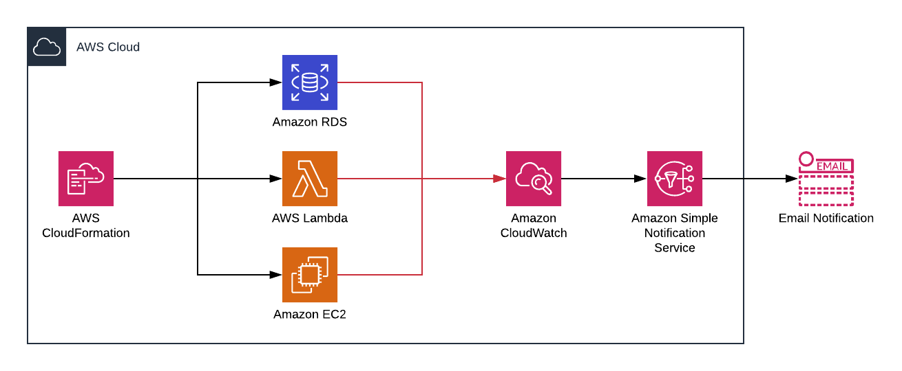

# Automatic CloudWatch Alarm

This CloudFormation template create a CloudWatch alarm based on a Lambda function. It gets triggered when a new resource is created.

The following resources trigger the CloudWatch alarm:

- EC2
- Auto escaling group
- Lambda
- RDS

## An example diagram:

<p align="center">
  
</p>

## Intructions to deploy:

This instructions are if you want to deploy the cloudformation from aws cli.
First its necessary to create a bucket:

```bash
aws s3 mb aws s3 mb s3://<bucketname>
```

Then, upload the project files:

```bash
aws s3 sync . "s3://<bucketname>/<Prefix>" --exclude "*" --include "*.yaml" --include "*.zip"
```

And finally create the cloudformation:

```bash
aws cloudformation create-stack --stack-name "<StackName>" --template-body file://master.yml --parameters   ParameterKey=StackName,ParameterValue="<Stackname>"  ParameterKey=S3BucketName,ParameterValue="<TemplatesBucketName>" ParameterKey=S3KeyPrefix,ParameterValue="<Prefix>"ParameterKey=SNSTopicARN,ParameterValue="<SNSTopicARN>"  --capabilities CAPABILITY_NAMED_IAM
```