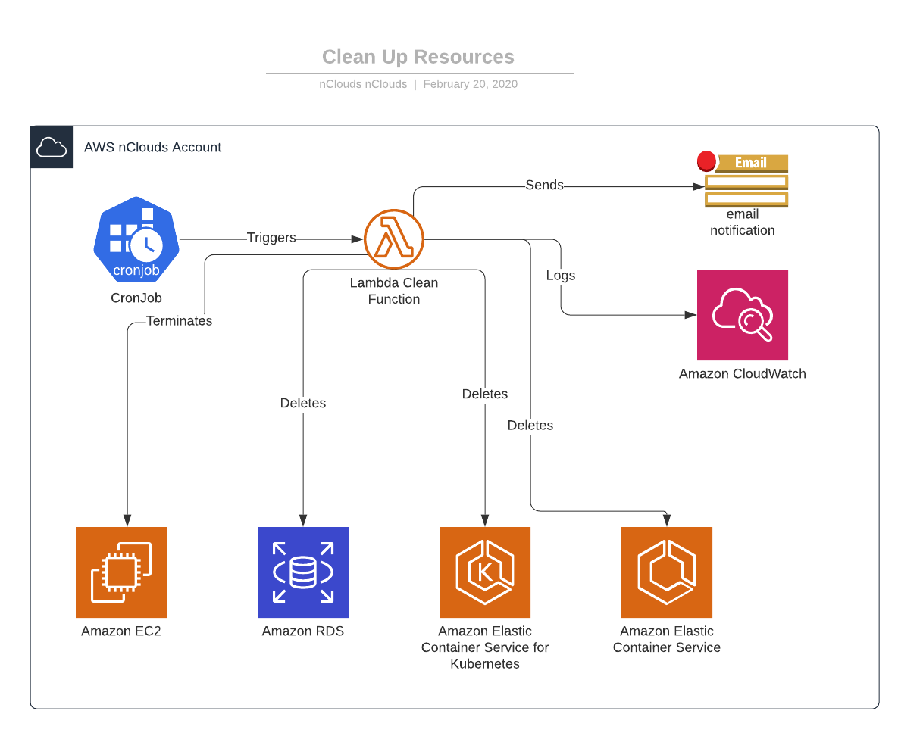

# Cloudformation Template to Clean nClouds Resources

## Description
The following template deploys the following resources:

* SNS Topic: publishes notification to an email about the process
* IAM Role: Role for lambda function to execute clean up
* Lambda function: Lambda function in charge of cleaning resources
* Event Rule: Deploys a cron job to schedule lambda execution at 00:00:00
* Permission: gives permission to invoke lambda function

### Lambda Function
The lambda function is in charge of terminating the following resources on all active regions:

* EC2 Instances
* RDS Instances
* RDS Aurora Clusters
* EKS Clusters
* ECS Clusters

To avoid any of these resources being terminated, the resources need to have the following mandatory tags:
* Owner: this tag represents the name of the person who is deploying the resource
* Team: this tag represents the name team's name of the person who is deploying the resources
* Client: this tag represents the client's name for which the resource is being deployed for

## Diagram

    

## Template Parameters
| Parameter        | Type           | Description  |
| ------------- |:-------------:| -----:|
| BucketS3      | S3 Bucket where the template is hosted | String |
| TimeOut     | Time out for the lambda, default is maximum, 15 mins      |   Number |
| EmailAddress | Email address to send notification about the process      |    String |
| OwnerName |  Name of the owner of the stack, it is required to tag resources deployed by the template   |    String |
| Team |  Team's name of the person who is deploying the template, it is required to tag resources deployed by the template    |    String |
| Client |  represents the client's name for which the resource is being deployed for, it will be used to tag resources  |    String |
| StackName |  The name of the stack to which these resources belong to, this is required to tag resources deployed by the template  |    String |
