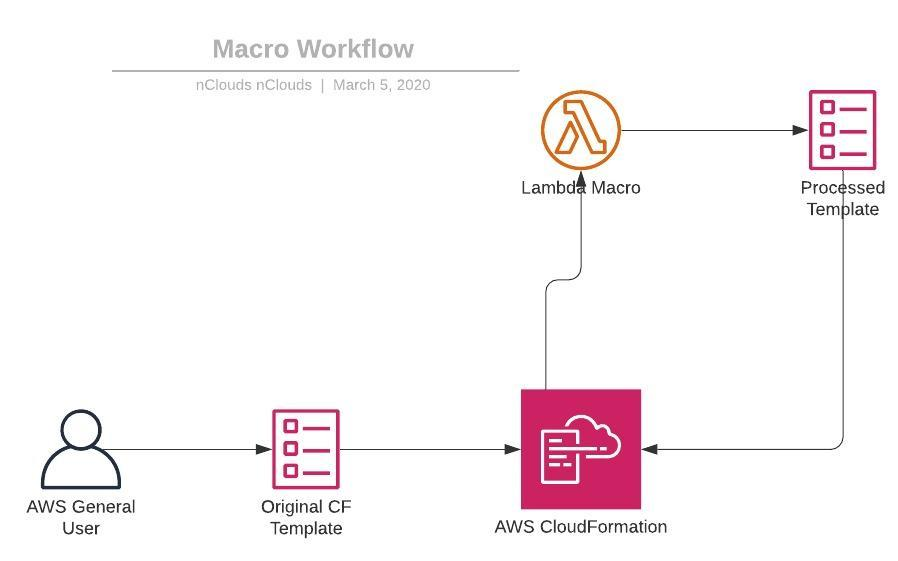

# Tagging Macro for Cloudformation Templates

## Description
The macro is in charge of adding tags to the following type of resources:
* ```AWS::EC2::Instance```
* ```AWS::RDS::DBInstance```
* ```AWS::ECS::Cluster```
* ```AWS::EKS::Cluster```
* ```AWS::EC2::VPC```
* ```AWS::DynamoDB::Table```

So, if your cloudformation template contains one or more of the following resources, it is recommended to use it to tag resources with mandatory tags.

### Mandatory Tags

The purpose of this macro is to attach mandatory tags to resources launched on the nclouds account, so the following are mandatory:
* Client
* Owner
* OwnerName
* Team

### Workflow diagram

<center>

</center>


## How to use it

Each individual template has a transform section in order to process the whole template with a macro. On the transform section you can call the macro like this:

```yml
Transform:
  - Name: tag-macro
    Parameters:
      Owner: 'any_value'
      Team: 'any_value'
      Client: 'any_value'
      OwnerEmail: 'any_value'
```
You can add as many tags as you want:
```yml
Transform:
  - Name: tag-macro
    Parameters:
      Owner: 'any_value'
      Team: 'any_value'
      Client: 'any_value'
      OwnerEmail: 'any_value'
      other_tag: 'other_value'
      any_tag: 'any_value'
      .
      .
      .
      last_tag: 'last_value'
```
**Important:** You can add more tags but remember you need to provide the following parameters to avoid errors:

* Owner
* Team
* Client
* OwnerEmail

Macro will be available on the following regions:

* us-east-1
* us-west-2

## Example

* Consider the following template:

```yml
Description: >-
  Resources for a VPC
Parameters:
  OwnerName:
    Type: String
    Description: An arbitrary tag name for the owner of these resources
  StackName:
    Type: String
    Description: The name of the stack to which these resources belong
  Environment:
    Type: String
    Default: dev
    AllowedValues: [ prod, stage, dev, qa, mgmt ]
    Description: Environment name to append to resources names and tags
Resources:
  VPC:
    Type: AWS::EC2::VPC
    Properties:
      CidrBlock: 192.168.10.0/24
      InstanceTenancy: default
      EnableDnsHostnames: true
      EnableDnsSupport: true
      Tags:
        - Key: Name
          Value: !Sub test-${Environment}
        - Key: Owner
          Value: !Ref OwnerName
        - Key: StackName
          Value: !Ref StackName
        - Key: Environment
          Value: !Ref Environment

  VPC2:
    Type: AWS::EC2::VPC
    Properties:
      CidrBlock: 192.168.10.0/24
      InstanceTenancy: default
      EnableDnsHostnames: true
      EnableDnsSupport: true
```
* Call the mcaro to tag the resources by adding the transform section to the template:
```yml
AWSTemplateFormatVersion: 2010-09-09
Transform:
  - Name: tag-macro
    Parameters:
      Owner: 'ricardo'
      Team: 'layer2'
      Client: 'nclouds'

Description: >-
  Resources for a VPC
Parameters:
  OwnerName:
    Type: String
    Default: ricardo
    Description: An arbitrary tag name for the owner of these resources
  StackName:
    Type: String
    Default: ricardo-test
    Description: The name of the stack to which these resources belong
  Environment:
    Type: String
    Default: dev
    AllowedValues: [ prod, stage, dev, qa, mgmt ]
    Description: Environment name to append to resources names and tags
Resources:
  VPC:
    Type: AWS::EC2::VPC
    Properties:
      CidrBlock: 192.168.10.0/24
      InstanceTenancy: default
      EnableDnsHostnames: true
      EnableDnsSupport: true
      Tags:
        - Key: Name
          Value: !Sub test-${Environment}
        - Key: Owner
          Value: !Ref OwnerName
        - Key: StackName
          Value: !Ref StackName
        - Key: Environment
          Value: !Ref Environment

  VPC2:
    Type: AWS::EC2::VPC
    Properties:
      CidrBlock: 192.168.10.0/24
      InstanceTenancy: default
      EnableDnsHostnames: true
      EnableDnsSupport: true
```
* Both VPCs will be tagged using tags provided to the macro