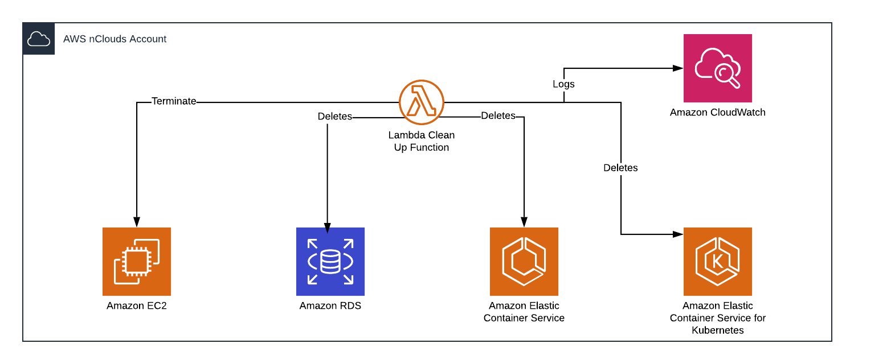

# Clean Up Resources

## Description

The following lambda function is in charge of terminating the following resources on all active regions:

* EC2 Instances
* RDS Instances
* RDS Aurora Clusters
* EKS Clusters
* ECS Clusters

To avoid any of these resources being terminated, the resources need to have the following mandatory tags:
* Owner: this tag represents the name of the person who is deploying the resource
* Team: this tag represents the name team's name of the person who is deploying the resources
* Client: this tag represents the client's name for which the resource is being deployed for

## Diagram

    

* The lambda function works like this:
 1. Lists the resources of all regions
 2. Checks if the resource has the mandatory tags
 3. If one of the mandatory tags is missing on the resource, it is terminated/deleted.
 4. Sends logs to cloudwatch to see what resources are being deleted/terminated
