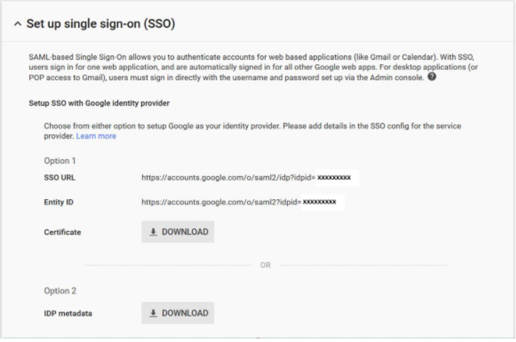

# AWS IDP Provider
​
## Terraform
​
This terraform proyect brings up an AWS IDP Provider using the `google-idp.xml` file. So please be sure to generate that file first.
Also this proyect also has some IAM sample roles that you can use and customize as you like
​
## Generating the google-idp.xml file

Let’s get the SAML metadata that contains essential information to enable your AWS account to authenticate the IdP and locate the necessary endpoint locations:

- Log in to your [Google Admin console](https://admin.google.com/) with your super administrator credentials.
​
- Click **More Controls > Security > Set up single sign-on (SSO)**. The following screenshot shows the Set up single sign-on (SSO) page.

**Note:** Make a note of the IdP ID at the end of the SSO URL. This is your Google customer ID and you will need to know this later. For the purposes of this blog post, I have anonymized my customer ID to be **XXXXXXXXX**, but yours will be an actual ID number.

- Click Download next to IDP metadata under Option 2 to download the IdP metadata file. This is the format we need for the AWS IdP configuration.

- Copy and Rename the SAML file in this proyect. Named it as: `google-idp.xml`
